# SPOCK GAME

## User Experience (UX)

## User story

- As a game player, I want a intuitive and easy-to-understand mechanics so that I don't have to spend too much time reading through lengthy instructions. Additionally, I would like to see animations and interactive features instead of a static game. It's important that all game information is displayed in an easy-to-read format with good contrast and appropriate size. Ultimately, as a game player, I want to be challenged and have fun.
 
 

# Wireframes 

- The layout of the game and its javascript functionalities were based on the following wireframes

## In course game 
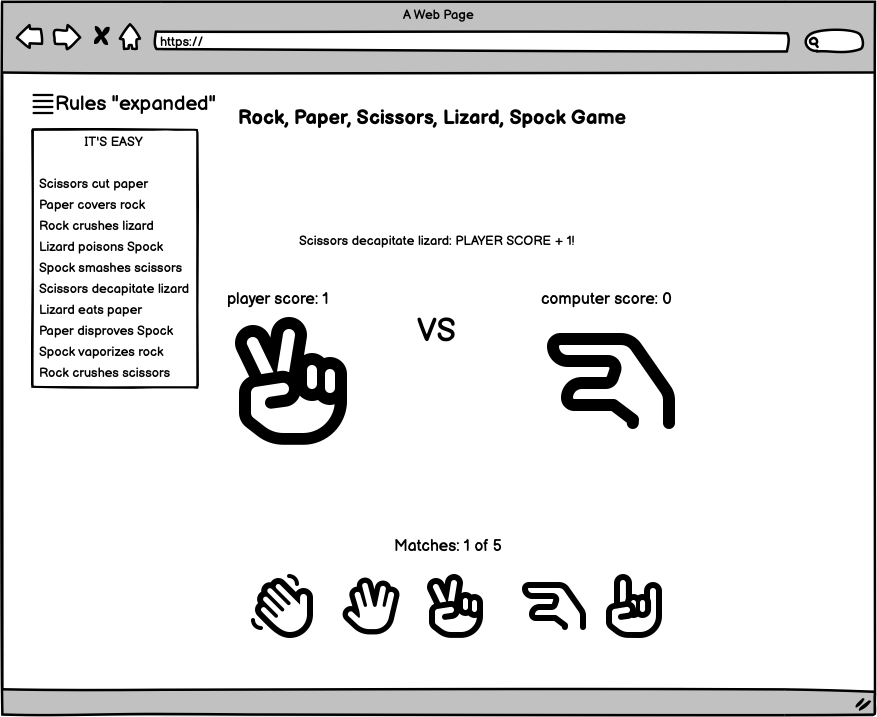

## End of the 5 matches

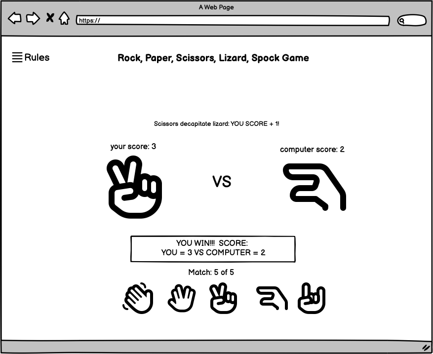

## mobile
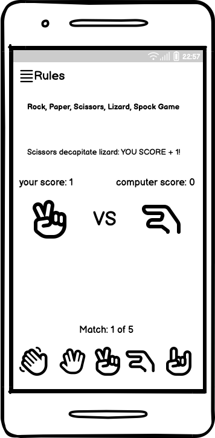

# DESIGN:

# Spock Game
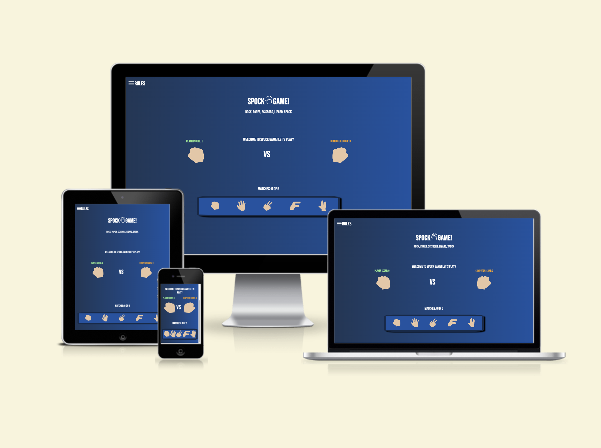

live link: <a href="https://humberto-pereira.github.io/spock-game/" target="_blank">Spock Game live link</a>

- Welcome to Spock Game, the world of Rock Paper Scissors Lizard Spock! The game aims to bring a fresh twist to the classic game of Rock Paper Scissors by introducing two additional elements: Lizard and Spock. This project is designed to provide a fun and interactive gaming experience for players of all ages while also challenging their strategic thinking and decision-making skills.
The Rock Paper Scissors Lizard Spock game is intended to target casual gamers, enthusiasts of classic games. The game offers an entertaining way to engage in friendly competitions and test your abilities.
 
 

# Features

## Color pallet

- The color scheme of the web game is a gradient of two shades of blue and beige "skin-color", green , orange and white. The green represents the player, while the orange represents the computer. This provides sufficient contrast for all users. 

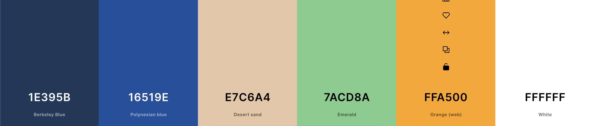
 
 

## Font style

- The font style used for the game layout is the Bebas Neue "Google Fonts". However, if there are any font compatibility issues, the backup fonts include Tahoma, Verdana, and sans-serif. 

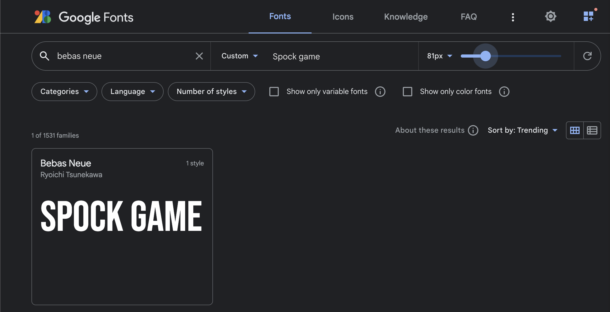
 
 

# Favicon

- A favicon with the web game logo was added to help the user identify the browser tab easier

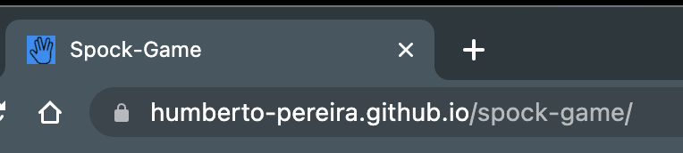
 
 

## logo

- Our logo is designed with simplicity in mind, featuring Spock's iconic Vulcan Salute hand gesture from Star Trek, encompassed by the words "Spock Game."

 
 

## Hamburger menu 

- The Rules hamburger menu is located at the upper right side of the screen. Its purpose is to inform the game player about all possible win-and-lose scenarios.

## Hamburger menu expanded

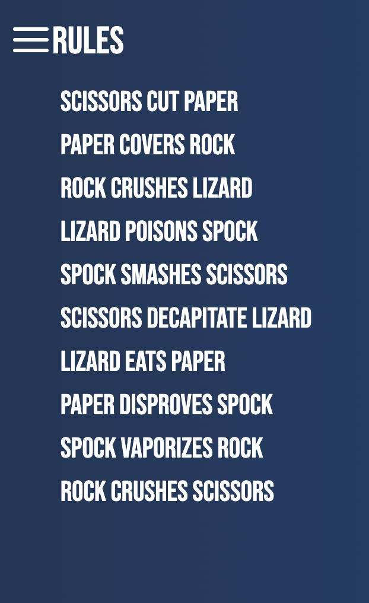 
 
 

## The game field

- On the Game field, you can see the scores of both the player "green" and the computer "orange", along with a message indicating the winner of the match, the game rules and +1 for the match winner or 0 when is a tie. Additionally, the player's chosen image option is displayed under their score, while the computer's choice image is shown under its score, which is generated randomly by the game's AI.
 
 

## Buttons

- Below the game field, you will find buttons displaying all five possible options in an easy-to-understand image format. Above these buttons, a text field indicates the number of matches out of a total of five that have been played.
 
 

# Testing Game Features 

- The Rules hamburger menu: is expected to expand when clicked and display the rules without moving or resizing any other game element at screens above 912px with the (CSS position: absolute;) testing: The feature work flawlessly as expected.

- At mobile version screens under 912px, the hamburger menu is set as CSS position: relative; all layout moves down to make space for the rules list; it has this behavior because of a space meter; testing: the feature works flawlessly as expected.

- The game field area: is expected to show the player score and computer score and should increment by one the score of the winner or no increment if its a tie; it should also show a text with the applicable game rule for the match clarifying who and why it's a win or loss; under the text of the score, is displayed the hands sign image, it should display the player choice and in the other side is the computer hand sign image choice generated randomly by the game AI; testing: All these features work as described and work flawlessly as expected.

- The buttons section: at the bottom of the layout, there is a container with five clickable hand sign images; when you click on the image of choice, it should trigger the animation of the image at the game field area, rotating 30 deg up and down three times, displaying the chosen image at the end of the animation, at the computer side happen the same but the image is chosen by the game AI; testing: All these features work as described and work flawlessly as expected.

- At the top of the button container, there is the match counter; it adds one to the counter every time that one button "hand sign image" is clicked and the animation is performed, the rule is displayed, and the scores are updated with the exception of a tie the scores don't change, but the matches number is updated with + one; when the match counter reaches 5 is the end of the game, then is displayed the winner message "player in green color or computer in orange color" and the final score, when you click in any of the buttons for the sixth time it displays an alert message "New Game?" when you click ok, it should reset all scores to zero and match counter to zero rules message to a welcome message, the winner message clears, and both hand images are displayed the rock hand sign image as initial images and its ready for another five matches; testing: All these features work as described and work flawlessly as expected.
 
 

# Testing Layout in Different Screen Sizes

## Desktop 1920 x 1200 

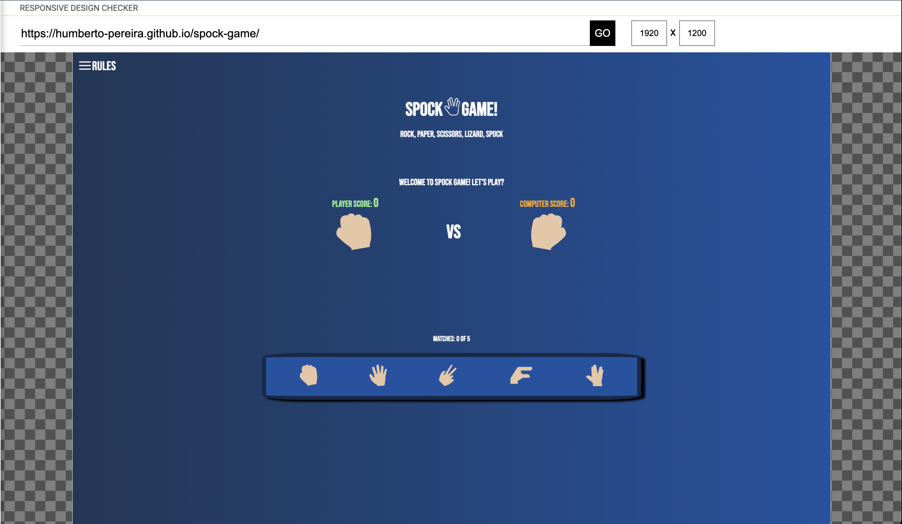
 
 

## Desktop 1920 x 1080

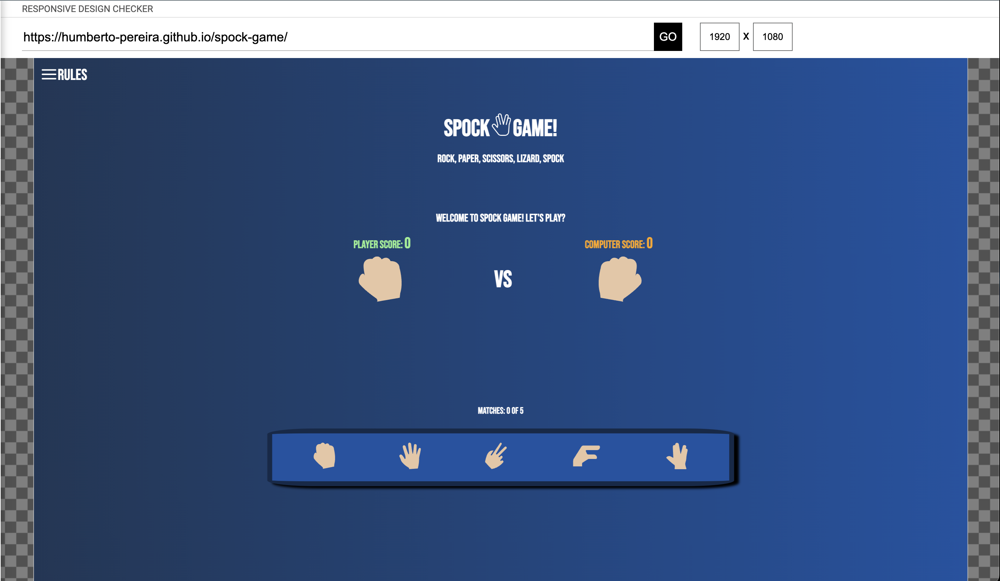
 
 

## Laptop 1366 x 768

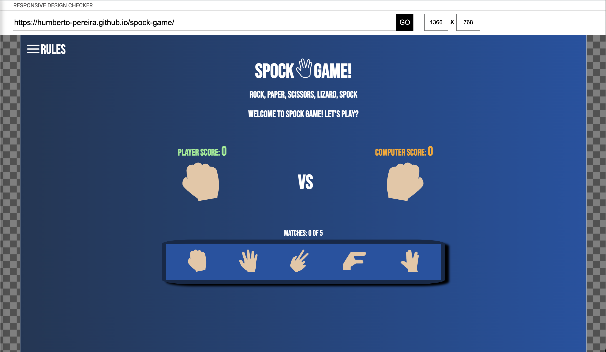
 
 

## Laptop 1024 x 800

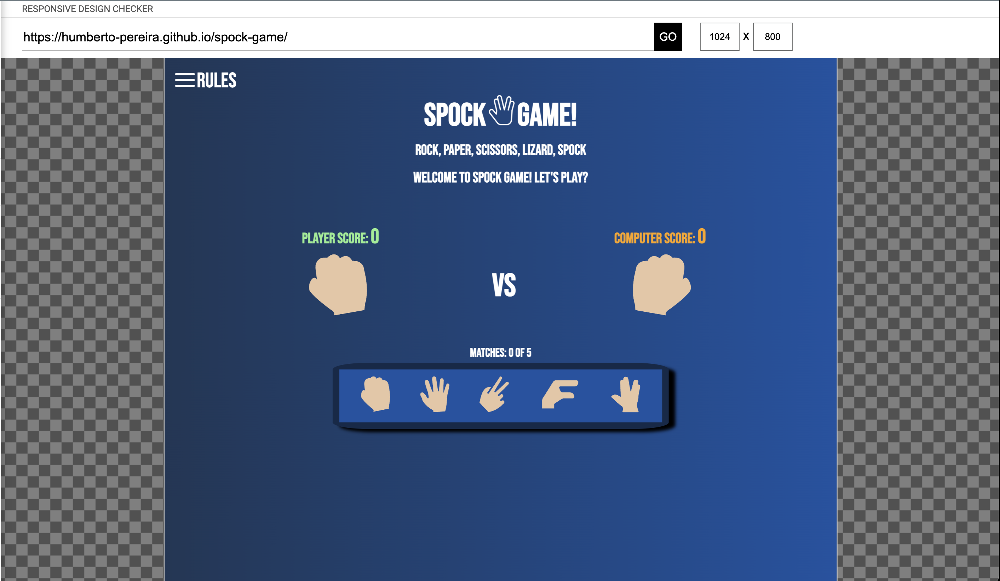
 
 

## Laptop 1024 x 600

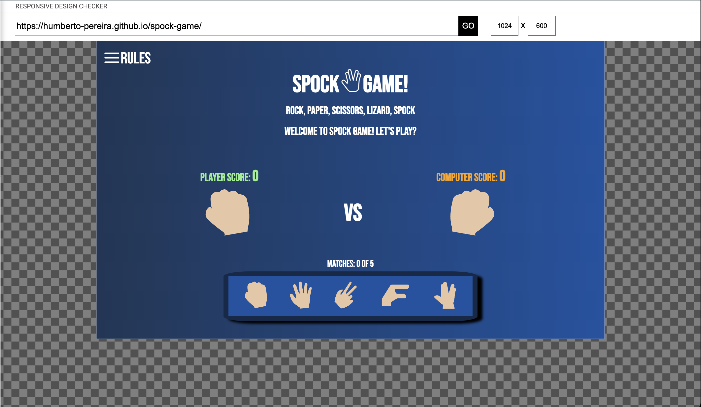
 
 

## Tablet 768 x 1024

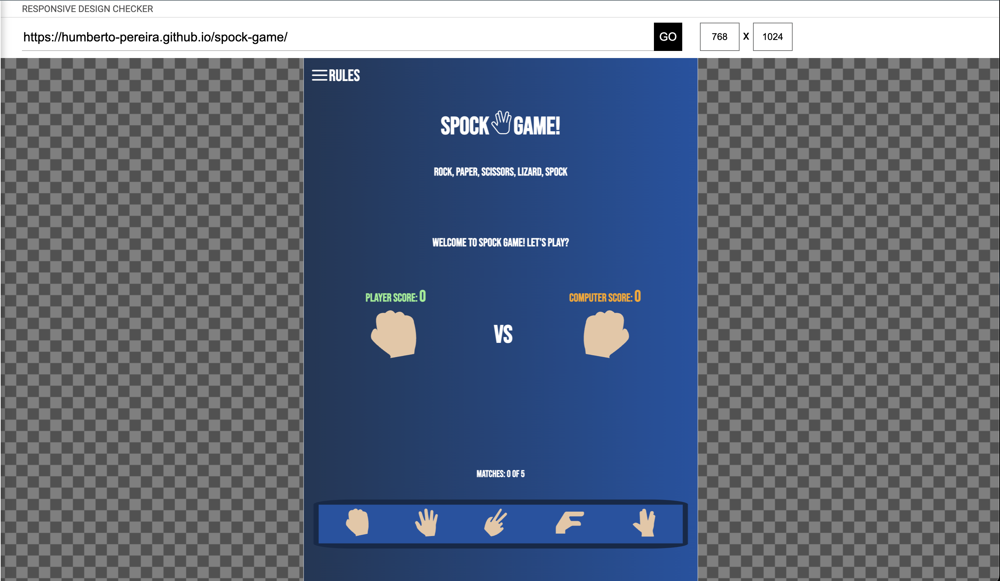
 
 

## Tablet 600 x 960

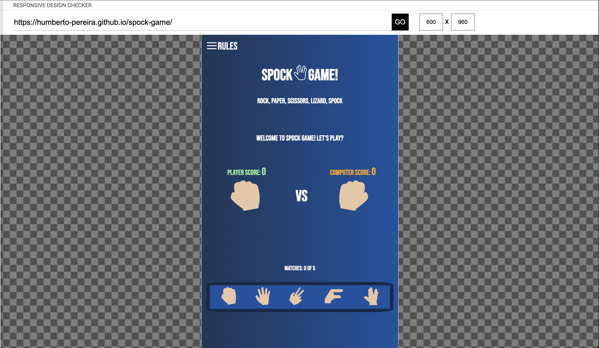
 
 

## Smart-Phone 414 x 736

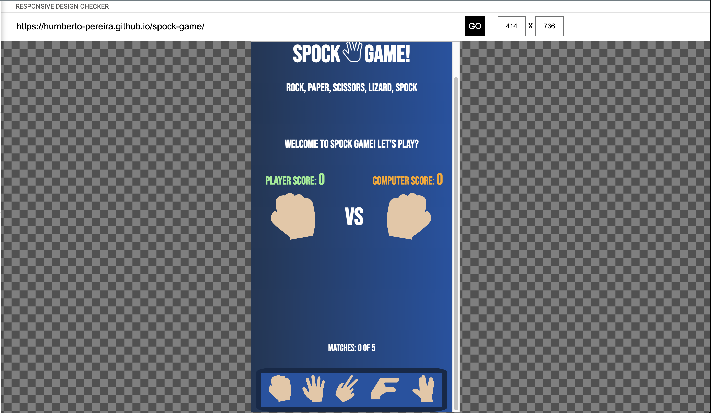
 
 

## Smart-Phone 375 x 667

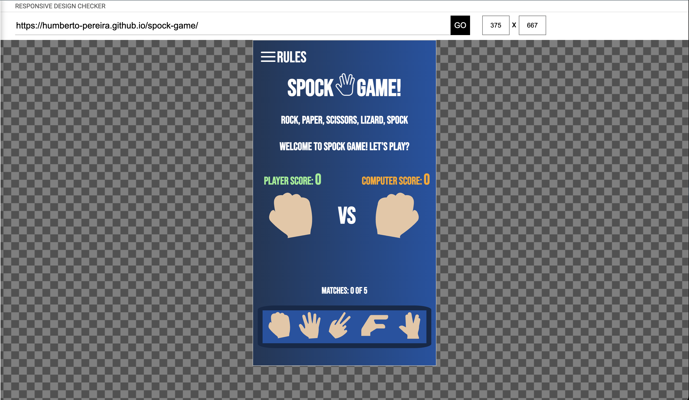
 
 

## Smart-Phone 360 x 640

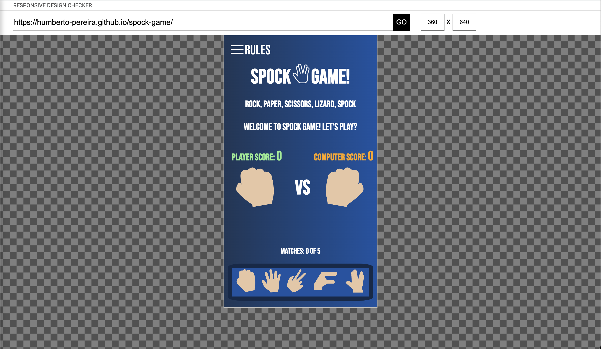
 
 

## Smart-Phone 320 x 568

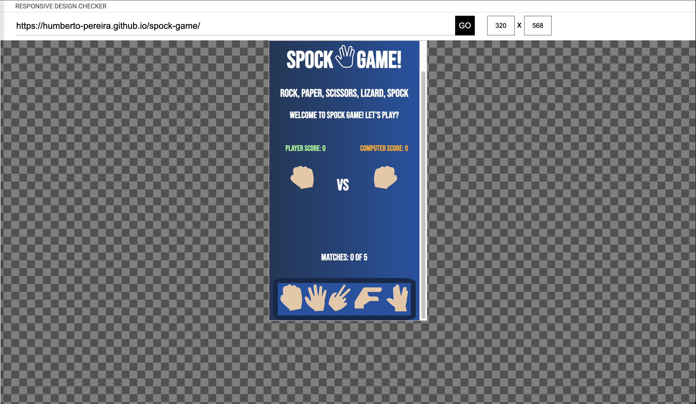
 
 
# Technologies and tools used

- Technologies: HTML, CSS and JavaScript.
- Tools: Vs Code for all coding along with extensions like "auto close tag, auto rename tag, css peak and more", Balsamiq for the creation of the wireframes.
 
 

# Validator Testing

- HTML: No errors were returned when passing through the official <a href="https://validator.w3.org/nu/?doc=https%3A%2F%2Fhumberto-pereira.github.io%2Fspock-game%2F" target="_blank">W3C Validator</a>

- CSS: No errors were found when passing through the official<a href="https://jigsaw.w3.org/css-validator/validator?uri=https%3A%2F%2Fhumberto-pereira.github.io%2Fspock-game%2F&profile=css3svg&usermedium=all&warning=1&vextwarning=&lang=pt-BR" target="_blank"> (Jigsaw) validator</a>

- JavaScript: No errors were found when passing through the eslint extension "the jshint vs code extension is deprecated," so alternatively, I used the "eslint," but I was not able to generate metrics like Love Maths readme.md example due to the "eslint" limitations. However, it pointed out some errors that have been fixed, so there are no errors in the JavaScript file.

## Fixed Bugs Along the Way
- Bug description#: I had problems figuring out how to pass computerChoice variable  as an argument; the solution was quite simple: 
  const computerChoice = generateComputerChoice(); 
  checkWinner(playerChoice, computerChoice); 
just had to create a variable that receives the (return) of generateComputerChoice(), and pass it through checkWinner(playerChoice, computerChoice) function.

- Bug description#: I had problems with the Rules hamburger menu function: "rulesMenu()"; after implementation, it did not work; after trying many approaches and searching on the web found out that the solution was quite simple and obvious the function had to be called at the "DOMContentLoaded" function.
- And many more bugs that have been fixed and learned lessons along the way.

## Unfixed Bugs

- There are no known unfixed bugs, all the features and functionalities works as expected.
 
 

# Deployment 

- The web-game was deployed at GitHub pages, with the following steps: 
- 1. Select the desired repository to be deployed.
- 2. Click on Settings. 
- 3. Select Pages from the left side menu. 
- 4. In the Source option, choose "Deploy from a branch." 
- 5. At the Branch option, select Main; and ensure the root file is also chosen. 
- 6. Click on Save. 
- 7. Wait for a few seconds, then refresh the page. The deployed page will be live, and the webpage link will be displayed.
- 8. The live link can be found here:<a href="https://humberto-pereira.github.io/spock-game/" target="_blank">Spock Game live link</a>
 
 

# Cloning  GitHub Repository
- 1. Open your terminal or command prompt on your local machine.
- 2. Navigate to the directory where you want to create the local copy of the repository.
- 3. Go to the GitHub repository page that you want to clone.
- 4. Click on the "Code" button located near the top right of the repository page.
- 5. Click on the clipboard icon to copy the repository's URL.
- 6. Return to your terminal or command prompt and type the following command:  git clone https://humberto-pereira.github.io/spock-game/
- 7. Press Enter to execute the command.
- 8. Wait for the cloning process to complete. Once finished, you will have a local copy of the GitHub repository on your machine.
 
 

# Forking a GitHub Repository
- 1. Go to the GitHub repository page that you want to fork in that case https://humberto-pereira.github.io/spock-game/.
- 2. Click on the "Fork" button located at the top right corner of the repository page.
- 3. Choose the GitHub account where you want to fork the repository. If you have multiple accounts, select the desired one.
- 4. Wait for the forking process to complete. Once finished, you will be redirected to the forked repository page under your GitHub account.
- 5. To create a local copy of the forked repository, follow the steps outlined in the "Cloning a GitHub Repository" section above.
 
 

# Credits 

- images: svg repo https://www.svgrepo.com/
- images: https://www.pngegg.com/
- CSS and JavaScript: I used many documentation sources like https://www.w3schools.com/ - https://stackoverflow.com/ - https://developer.mozilla.org/en-US/ - Code Institute - Google and many more, rather than copying it, I tried to understand the concept and apply it, like Flexbox, media-queries, js functions, variables, arguments, event listeners and much more... 
- The CSS hand-shaking animation and the JavaScript code were based on the youtube Code Grind channel <a href="https://www.youtube.com/watch?v=NTDBKgBY6JU&list=PLUNoBnR80iZAIwvgWg6vfvMLqmplYOz_f&index=1&t=1182s&ab_channel=CodeGrind">How to create Stone, Paper and Scissors Game using JavaScript! Complete tutorial | Code Grind</a> I customized it to fit the project's needs.
- The hamburger menu code was based on the WebDev Simplified youtube channel <a href="https://www.youtube.com/watch?v=At4B7A4GOPg&list=PLUNoBnR80iZBxwFoCIjNbO8ZK3fMf0v1m&index=8&t=426s&ab_channel=WebDevSimplified">Responsive Navbar Tutorial</a> I also customized it to feet into the project needs.
- The Code Institute <a href="https://github.com/Code-Institute-Solutions/readme-love-maths/blob/master/README.md"> Love Maths </a> code, as commented in the JS code, like this snippet: 
 // based on the Love-Maths code 
 document.addEventListener('DOMContentLoaded', function () { 
    const clickedButtons = document.getElementsByTagName('button') 
    for (const button of clickedButtons) { 
      button.addEventListener('click', function () { 
- I used and learned a lot through the Love Maths videos and code; I Used it as a reference to create my own code and web game, the Spock Game.
