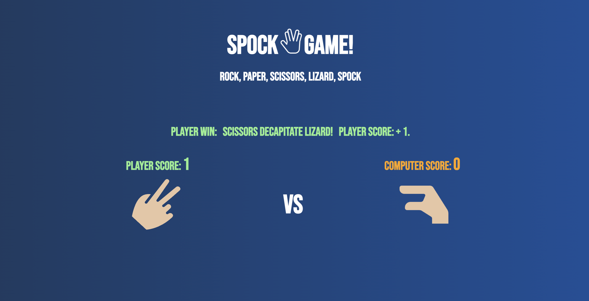

# SPOCK GAME

## User Experience (UX)

## User story

- As a game player, I want a intuitive and easy-to-understand mechanics so that I don't have to spend too much time reading through lengthy instructions. Additionally, I would like to see animations and interactive features instead of a static game. It's important that all game information is displayed in an easy-to-read format with good contrast and appropriate size. Ultimately, as a game player, I want to be challenged and have fun.

# Wireframes 

- The layout of the game and its javascript functionalities were based on the following wireframes

## In course game 

## End of the 5 matches

## mobile

# DESIGN:

## Color pallet

- The color scheme of the web game is a gradient of two shades of blue and beige "skin-color", green , orange and white. The green represents the player, while the orange represents the computer. This provides sufficient contrast for all users. 

## Font style

The font style used for the game layout is the Bebas Neue "Google Fonts". However, if there are any font compatibility issues, the backup fonts include Tahoma, Verdana, and sans-serif. 

# Spock Game

- Welcome to Spock Game, the world of Rock Paper Scissors Lizard Spock! The game aims to bring a fresh twist to the classic game of Rock Paper Scissors by introducing two additional elements: Lizard and Spock. This project is designed to provide a fun and interactive gaming experience for players of all ages while also challenging their strategic thinking and decision-making skills.
The Rock Paper Scissors Lizard Spock game is intended to target casual gamers, enthusiasts of classic games, and anyone looking for a new and exciting take on a familiar concept. The game offers an entertaining way to engage in friendly competitions and test your abilities.
 
 

# Features
## logo

- Our logo is designed with simplicity in mind, featuring Spock's iconic Vulcan Salute hand gesture from Star Trek, encompassed by the words "Spock Game."

 
 

## Hamburger menu 

- The Rules hamburger menu is located at the upper right side of the screen. Its purpose is to inform the game player about all possible win-and-lose scenarios.

## Hamburger menu expanded

 
 
 

## The game field

- On the Game field, you can see the scores of both the player "green" and the computer "orange", along with a message indicating the winner of the match and the game rules. Additionally, the player's chosen image option is displayed under their score, while the computer's choice image is shown under its score, which is generated randomly by the game's AI.
 
 

## Buttons

- Below the game field, you will find buttons displaying all five possible options in an easy-to-understand image format. Above these buttons, a text field indicates the number of matches out of a total of five that have been played.
 
 

# Testing Game Features 

- The Rules hamburger menu: is expected to expand when clicked and display the rules without moving or resizing any other game element at screens above 912px with the (CSS position: absolute;) testing: The feature work flawlessly as expected.

- At mobile version screens under 912px, the hamburger menu is set as CSS position: relative; all layout moves down to make space for the rules list; it has this behavior because of a space meter; testing: the feature works flawlessly as expected.

- The game field area: is expected to show the player score and computer score and should increment by one the score of the winner or no increment if its a tie; it should also show a text with the applicable game rule for the match clarifying who and why it's a win or loss; under the text of the score, is displayed the hands sign image, it should display the player choice and in the other side is the computer hand sign image choice generated randomly by the game AI; testing: All these features work as described and work flawlessly as expected.

- The buttons section: at the bottom of the layout, there is a container with five clickable hand sign images; when you click on the image of choice, it should trigger the animation of the image at the game field area, rotating 30 deg up and down three times, displaying the chosen image at the end of the animation, at the computer side happen the same but the image is chosen by the game AI; testing: All these features work as described and work flawlessly as expected.

- At the top of the button container, there is the match counter; it adds one to the counter every time that one button "hand sign image" is clicked and the animation is performed, the rule is displayed, and the scores are updated with the exception of a tie the scores don't change, but the matches number is updated with + one; when the match counter reaches 5 is the end of the game, then is displayed the winner message "player in green color or computer in orange color" and the final score, when you click in any of the buttons for the sixth time it displays an alert message "New Game?" when you click ok, it should reset all scores to zero and match counter to zero rules message to a welcome message, the winner message clears, and both hand images are displayed the rock hand sign image as initial images and its ready for another five matches; testing: All these features work as described and work flawlessly as expected.
 
 

# Testing Layout in Different Screen Sizes

## Desktop 1920 x 1200 

 
 

## Desktop 1920 x 1080

 
 

## Laptop 1366 x 768

 
 

## Laptop 1024 x 800

 
 

## Laptop 1024 x 600

 
 

## Tablet 768 x 1024

 
 

## Tablet 600 x 960

 
 

## Smart-Phone 414 x 736

 
 

## Smart-Phone 375 x 667

 
 

## Smart-Phone 360 x 640

 
 

## Smart-Phone 320 x 568

